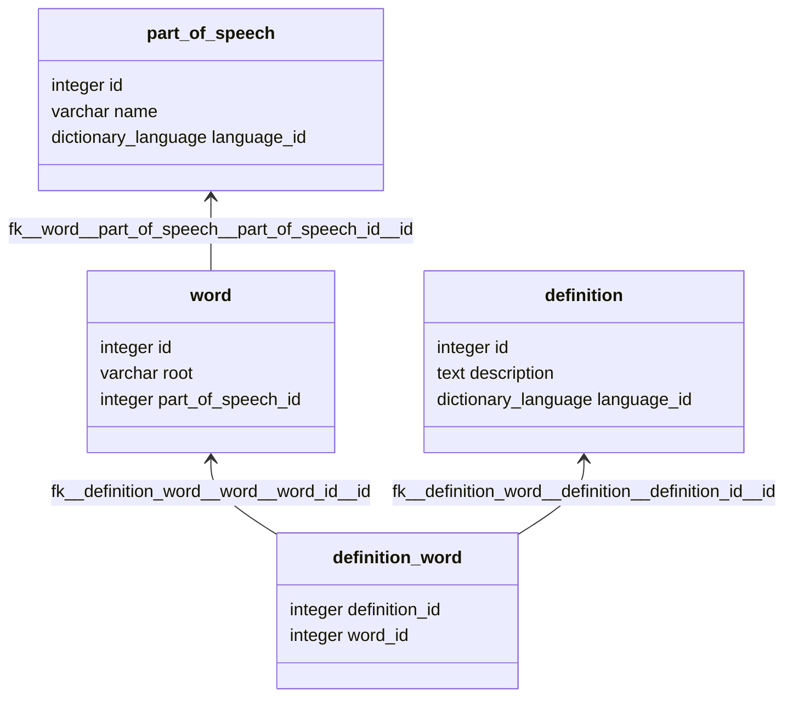

# Database

## Schema `dictionary`

### Types

| Type | Name                | Values                   |
|:-----|:--------------------|:-------------------------|
| ENUM | dictionary_language | ENGLISH, KAZAKH, RUSSIAN |

### Tables

